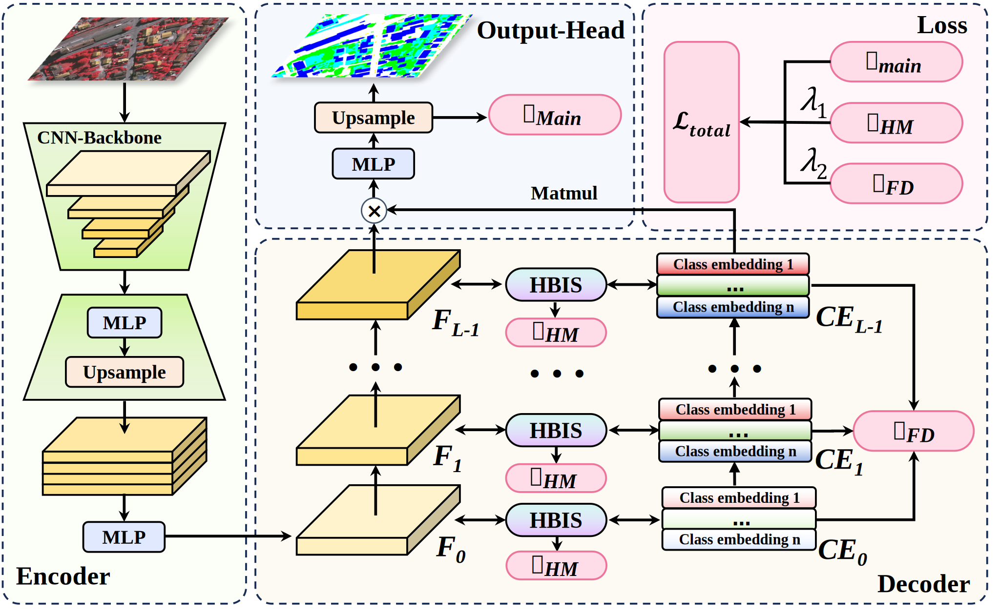

<div align="center">

# BiCoR-Seg

**Bidirectional Co-Refinement Framework for High-Resolution Remote Sensing Image Segmentation**




</div>

---

## 🔧 Install

```bash
conda create -n bicor python=3.8
conda activate bicor
conda install pytorch==1.10.0 torchvision==0.11.0 torchaudio==0.10.0 cudatoolkit=11.3 -c pytorch -c conda-forge
pip install -r requirements.txt
```

---

## 🗂 Prepare Data

Prepare the following folders to organize this repo (same as [GeoSeg](https://github.com/WangLibo1995/GeoSeg)):

```none
BiCoR
├── network
├── config
├── tools
├── model_weights          (save the model weights)
├── fig_results            (save the masks predicted)
├── lightning_logs         (CSV format training logs)
├── data
│   ├── LoveDA
│   ├── potsdam
│   ├── vaihingen
```

---

## 🧭 Data Preprocessing

### 📦 Download Datasets
- [ISPRS Vaihingen, Potsdam](https://www.isprs.org/education/benchmarks/UrbanSemLab/default.aspx)
- [LoveDA](https://codalab.lisn.upsaclay.fr/competitions/421)

Follow the preprocessing scripts as below (same as D2LS, all `d2ls` replaced by `bicor`):

---

### Vaihingen
```bash
python tools/vaihingen_patch_split.py --img-dir "data/vaihingen/train_images" --mask-dir "data/vaihingen/train_masks" --output-img-dir "data/vaihingen/train/images_1024" --output-mask-dir "data/vaihingen/train/masks_1024" --mode "train" --split-size 1024 --stride 512
```

---

### Potsdam
```bash
python tools/potsdam_patch_split.py --img-dir "data/potsdam/train_images" --mask-dir "data/potsdam/train_masks" --output-img-dir "data/potsdam/train/images_1024" --output-mask-dir "data/potsdam/train/masks_1024" --mode "train" --split-size 1024 --stride 1024 --rgb-image
```

---

### LoveDA
```bash
python tools/loveda_mask_convert.py --mask-dir data/LoveDA/Train/Rural/masks_png --output-mask-dir data/LoveDA/Train/Rural/masks_png_convert
```

---

## 🧩 Training

`-c` denotes the path of the config file.  
Use different configs to train on different datasets.

```bash
python train.py -c config/loveda/bicor.py
```

---

## 🧪 Testing

`-c` = config path  
`-o` = output path  
`-t` = test time augmentation (TTA), can be `[None, 'lr', 'd4']`  
`--rgb` = output RGB masks

### Vaihingen
```bash
python test_vaihingen.py -c config/vaihingen/bicor.py -o fig_results/vaihingen/bicor --rgb -t 'd4'
```

### Potsdam
```bash
python test_potsdam.py -c config/potsdam/bicor.py -o fig_results/potsdam/bicor --rgb -t 'lr'
```

### LoveDA ([Online Testing](https://codalab.lisn.upsaclay.fr/competitions/421))
```bash
python test_loveda.py -c config/loveda/bicor.py -o fig_results/loveda/bicor --rgb -t "d4"
```

---

## 🖼 Framework Overview

<p align="center">
  
</p>

**Figure 1.** The overall framework of BiCoR-Seg.  
It introduces a heatmap-driven bidirectional synergy between feature and class embedding spaces.

<p align="center">
  
</p>

**Figure 2.** The HBIS module structure, showing the Feature-to-Class (F2CE) and Class-to-Feature (CE2F) bidirectional refinement process.

---

## 🔥 Heatmap Visualization

<p align="center">
  
</p>

**Figure 3.** Visualization of hierarchical class heatmaps from BiCoR-Seg.  
They reveal category activation and spatial attention learned during the bidirectional refinement process.

---

## 💬 Acknowledgement

This code is built upon [GeoSeg](https://github.com/WangLibo1995/GeoSeg).  
We sincerely thank the open-source community for their contributions.

---
